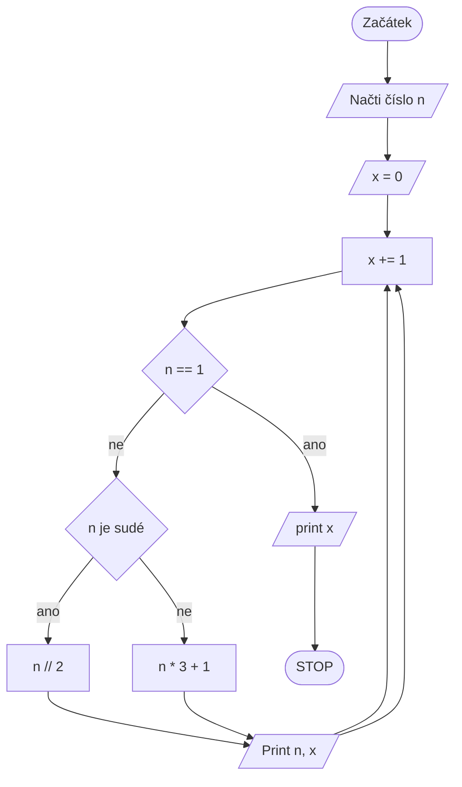

## Diagram

```mermaid
flowchart TD
    start([Začátek])
    input[/Načti číslo n/]
    if{n je sudé}
    even[n // 2]
    odd[n * 3 + 1]
    n{n == 1}
    stop([STOP])
    init[/x = 0/]
    count[x += 1]
    print[/print x/]
    step[/Print n, x/]


    start --> input
    input --> init
    init --> count --> n


    n -- ne --> if
    n -- ano --> print
    if -- ano --> even
    if -- ne --> odd
    even --> step --> count 
    odd --> step --> count

    print --> stop
    
   
    


```
