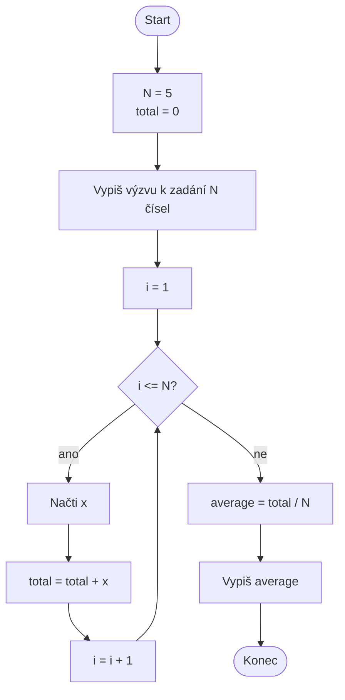

# Výpočet průměrné hodnoty

Navrhněte vývojový diagram algoritmu, který načte právě **pět čísel**,
průběžně je sčítá a po načtení posledního čísla vypočítá a vypíše jejich
aritmetický průměr. Diagram musí zachytit inicializaci součtu, opakované
načítání pěti hodnot, aktualizaci součtu i závěrečný výpočet.


## Pseudokód

```
NASTAV N = 5
NASTAV total = 0

VYPIŠ "Zadej N čísel"

PRO i od 1 do N
NAČTI x
total = total + x
KONEC PRO

average = total / N
VYPIŠ average
```

## Ukázková implementace v Pythonu

```python
# number of values (constant)
N = 5

total = 0

print(f"Enter {N} numbers:")

for i in range(1, N + 1):
    x = float(input(f"Value #{i}: "))
    total = total + x

average = total / N
print("Average value:", average)
```

<details>
<summary>Řešení – vývojový diagram</summary>



</details>
