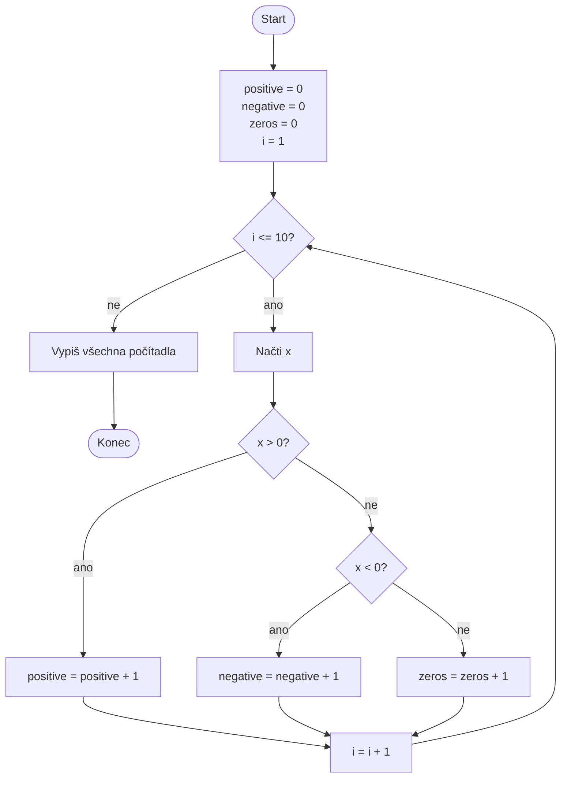

# Kolik čísel je kladných, záporných a nulových?

Navrhněte vývojový diagram algoritmu, který načte **deset celých čísel** a na
konci vypíše:

- počet kladných čísel,
- počet záporných čísel,
- počet nul.

Algoritmus na začátku nastaví tři počítadla na nulu. Každé načtené číslo
zařadí právě do jedné kategorie a zvýší odpovídající počítadlo. Diagram musí
zachytit opakování pro deset vstupů i rozhodování, které zaručí, že se případy
nepřekrývají.

## Pseudokód

```text
positive = 0
negative = 0
zeros = 0

PRO i od 1 do 10
    NAČTI x
    POKUD x > 0
        positive = positive + 1
    JINAK POKUD x < 0
        negative = negative + 1
    JINAK
        zeros = zeros + 1
    KONEC POKUD
KONEC PRO

VYPIŠ positive, negative, zeros
```

## Ukázková implementace v Pythonu

```python
positive = 0
negative = 0
zeros = 0

for i in range(1, 11):
    value = int(input(f"Value #{i}: "))

    if value > 0:
        positive = positive + 1
    elif value < 0:
        negative = negative + 1
    else:
        zeros = zeros + 1

print("Positive:", positive)
print("Negative:", negative)
print("Zeros:", zeros)
```

## Rozšíření

Přidejte součet kladných čísel a na konci vypočítejte jejich průměr. Ošetřete
případ, kdy uživatel nezadal žádné kladné číslo.

<details>
<summary>Řešení – vývojový diagram</summary>



</details>
