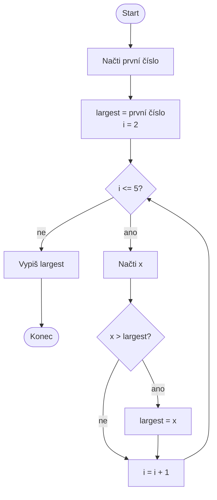

# Hledání největší hodnoty

Navrhněte vývojový diagram algoritmu, který načte **pět čísel** a vypíše
největší z nich bez použití vestavěné funkce `max()`. Algoritmus nejprve načte
první číslo a uloží je jako dosud největší hodnotu. Potom postupně načítá
zbývající čtyři čísla, každé porovná s dosavadním maximem a v případě potřeby
maximum nahradí. Po zpracování všech pěti čísel je vypíše.

Největší hodnotu neinicializujte nulou — všechna zadaná čísla mohou být
záporná. Jako první hodnotu proto použijte první skutečně načtené číslo.

## Pseudokód

```text
NAČTI první číslo
largest = první číslo

PRO i od 2 do 5
    NAČTI x
    POKUD x > largest
        largest = x
    KONEC POKUD
KONEC PRO

VYPIŠ largest
```

## Ukázková implementace v Pythonu

```python
largest = float(input("Value #1: "))

for i in range(2, 6):
    value = float(input(f"Value #{i}: "))
    if value > largest:
        largest = value

print("Largest value:", largest)
```

## Rozšíření

Upravte algoritmus tak, aby zároveň našel nejmenší hodnotu a pozici prvního
výskytu největší hodnoty.

<details>
<summary>Řešení – vývojový diagram</summary>



</details>
