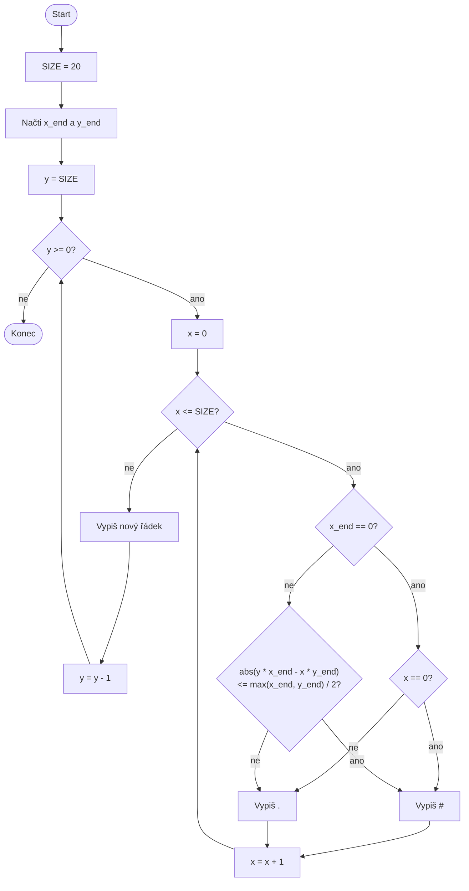

# Vykreslení přímky dané vektorem v ASCII mřížce


Cílem úlohy je navrhnout vývojový diagram algoritmu, který **vykreslí přímku
v textové (ASCII) podobě**. Program prochází celočíselné souřadnice od `0` do
`20` včetně, a proto vypíše mřížku **21 × 21 znaků**. Každý znak představuje
jeden bod v rovině.


## Vstup

Uživatel zadá dvě nezáporné celočíselné hodnoty, které nejsou obě nulové:

- `x` – x-ová složka vektoru (směr přímky)
- `y` – y-ová složka vektoru (směr přímky)

Tyto hodnoty určují **vektor vycházející z bodu (0, 0)**, který definuje směr přímky.


## Výstup

Program vypíše **ASCII obrázek mřížky 21 × 21**, kde:

- znak `#` označuje body, které leží **na přímce dané vektorem** (nebo jsou k ní nejblíže),
- znak `.` označuje ostatní body mřížky.

Přímka prochází bodem `(0, 0)` a má směr daný zadaným vektorem `(x, y)`.


## Omezení a pravidla

- Přímka je vykreslována **přímo při průchodu mřížkou**, bez předpočítávání bodů.
- Program používá pouze základní konstrukce:
  - vstup (`input`)
  - podmínky (`if`)
  - cykly (`while`)
  - výpis (`print`)
- Pokud je `x = 0`, jedná se o **svislou přímku**.

Algoritmus začne na horním řádku mřížky (`y = 20`) a postupuje dolů. Na každém
řádku projde hodnoty `x` zleva doprava. Pro každý bod rozhodne, zda vypíše `#`,
nebo `.`, a po dokončení řádku odřádkuje. U svislé přímky označí body s
`x = 0`; v ostatních případech použije podmínku uvedenou v implementaci.


## Smysl úlohy

Úloha ukazuje, že:

- algoritmy nejsou jen o počítání čísel, ale také o **vizuální reprezentaci dat**,
- matematický objekt (přímka) lze vykreslit pomocí **aproximace v diskrétní mřížce**,
- i složitější chování může vzniknout kombinací **jednoduchých smyček a podmínek**.


## Ukázková implementace v Pythonu

```python
# grid size
SIZE = 20

x_end = int(input("Enter x: "))
y_end = int(input("Enter y: "))

y = SIZE
while y >= 0:
    x = 0
    while x <= SIZE:
        if x_end == 0:
            # vertical line
            if x == 0:
                print("#", end="")
            else:
                print(".", end="")
        else:
            # distance from the line ax - by = 0 (scaled)
            if abs(y * x_end - x * y_end) <= max(x_end, y_end) / 2:
                print("#", end="")
            else:
                print(".", end="")
        x = x + 1
    print()
    y = y - 1
```

Vstup: `x=100`, `y=20`, Výstup:
```
.....................
.....................
.....................
.....................
.....................
.....................
.....................
.....................
.....................
.....................
.....................
.....................
.....................
.....................
.....................
.....................
..................###
.............#####...
........#####........
...#####.............
###..................
```

<details>
<summary>Řešení – vývojový diagram</summary>



</details>
