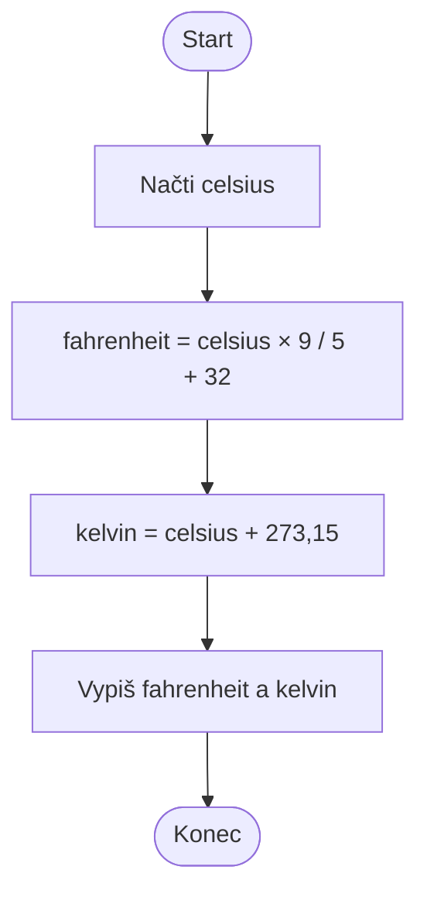

# Převod teploty ze stupňů Celsia

Cílem úlohy je navrhnout jednoduchý **sekvenční algoritmus**: načíst vstup,
provést výpočet a zobrazit výsledky.

Uživatel zadá teplotu ve stupních Celsia. Program ji převede na stupně
Fahrenheita a kelviny podle vztahů:

```text
fahrenheit = celsius × 9 / 5 + 32
kelvin = celsius + 273,15
```

Program vypíše obě převedené hodnoty. Vyzkoušejte alespoň teploty `0`, `100`
a `-40` °C a před spuštěním odhadněte výsledek.

## Vývojový diagram



## Pseudokód

```text
NAČTI celsius
fahrenheit = celsius * 9 / 5 + 32
kelvin = celsius + 273.15
VYPIŠ fahrenheit
VYPIŠ kelvin
```

## Ukázková implementace v Pythonu

```python
celsius = float(input("Temperature in °C: "))

fahrenheit = celsius * 9 / 5 + 32
kelvin = celsius + 273.15

print("Temperature in °F:", fahrenheit)
print("Temperature in K:", kelvin)
```

## Rozšíření

Výstup zaokrouhlete na dvě desetinná místa. Potom doplňte kontrolu, která
upozorní na teplotu nižší než absolutní nula (`-273.15 °C`).
