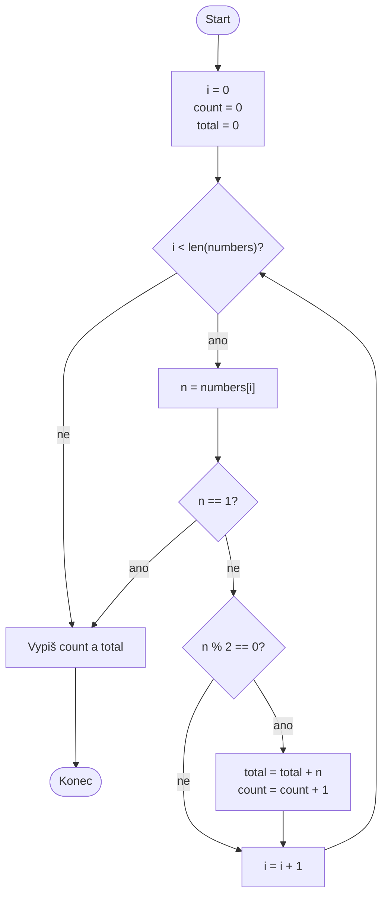

# Domácí příprava: vývojový diagram programu

## Cíl

Cílem domácí přípravy je procvičit si čtení programu a převod jeho řízení do diagramu. Nejde pouze o správný výsledek programu, ale především o zachycení podmínek, cyklu a pořadí jednotlivých kroků.

## Zadání

Pro následující program nakreslete diagram (flowchart / UML activity diagram), který znázorní jeho průběh:

```python
numbers = [5, 2, 8, 1, 6, 3]

i = 0
count = 0
total = 0

while i < len(numbers):
    n = numbers[i]

    if n == 1:
        break

    if n % 2 == 0:
        total += n
        count += 1

    i += 1

print("Count:", count)
print("Total:", total)
```

V diagramu zachyťte:

- začátek a konec programu,
- inicializaci proměnných,
- podmínku cyklu `while`,
- obě podmínky `if`,
- předčasné ukončení pomocí `break`,
- aktualizaci proměnných,
- závěrečný výpis.

Diagram nakreslete nejprve samostatně na papír nebo v libovolném nástroji. Potom své řešení porovnejte s ukázkou níže a případné rozdíly si poznamenejte.

## Ukázkové řešení


