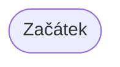
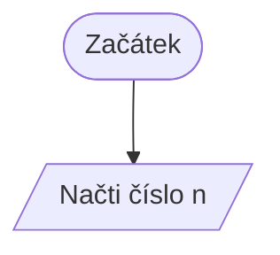
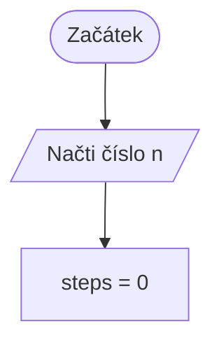
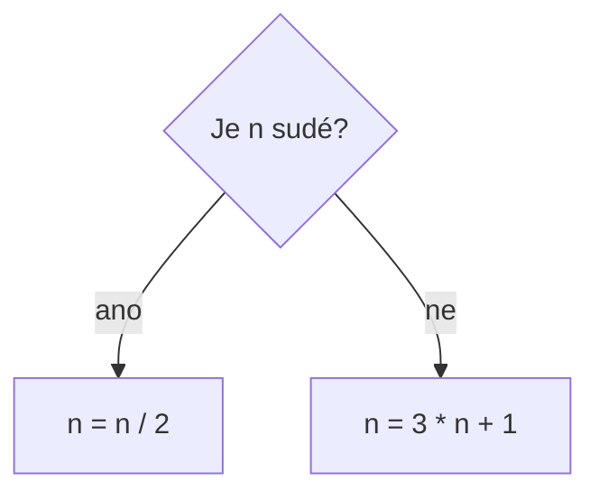
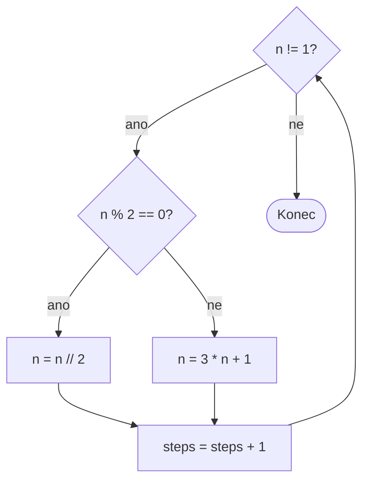
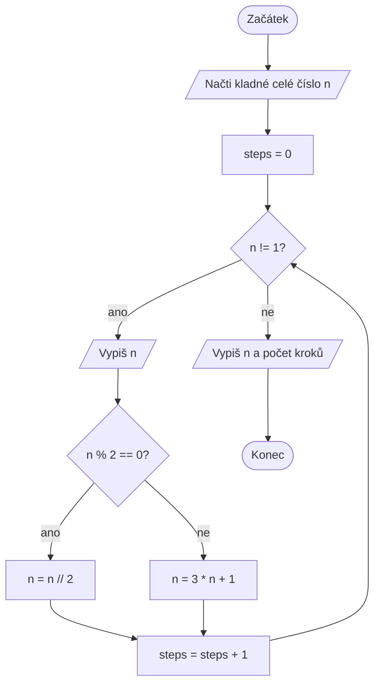
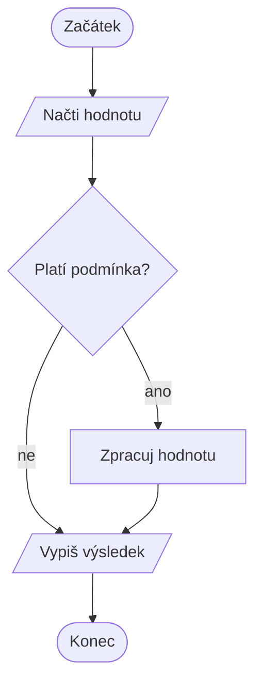

# Jak nakreslit Collatzovu úlohu v Mermaid

Mermaid umožňuje zapisovat diagramy jako text přímo do Markdownu. Tento návod
ukazuje postup od jednoho uzlu až po vývojový diagram celého programu pro
Collatzovu posloupnost.

## Jak vložit diagram do Markdownu

Diagram se zapisuje do bloku kódu označeného slovem `mermaid`. Následující
ukázka je **doslovný zápis**, který je potřeba vložit do Markdown souboru:

````text

````

Po vykreslení vznikne tento diagram:



Řádek `flowchart TD` říká, že jde o vývojový diagram vedený shora dolů
(*top-down*). Pro diagram zleva doprava lze použít `flowchart LR`.

## 1. Uzly a šipky

Každý uzel má vlastní krátký identifikátor, například `start` nebo `input`.
Text zobrazený v diagramu se píše do závorek. Šipka `-->` spojuje dva kroky.

````text

````



Použité tvary:

- `start([Začátek])` vytvoří zaoblený uzel pro začátek nebo konec,
- `input[/Načti číslo n/]` vytvoří kosodélník pro vstup nebo výstup,
- `step[Zpracuj hodnotu]` vytvoří obdélník pro příkaz,
- `test{Platí podmínka?}` vytvoří kosočtverec pro rozhodnutí.

## 2. Příkaz programu

Po načtení čísla potřebuje program nastavit počítadlo kroků. Běžný příkaz
zapíšeme do obdélníku.

````text

````


U textu obsahujícího zvláštní znaky je praktické použít uvozovky, například
`init["steps = 0"]`.

## 3. Rozhodování

Podmínka má dvě možné větve. Popisky větví se zapisují za šipku pomocí
`-- ano -->` a `-- ne -->`.

````text

````


V programu se sudost zjišťuje výrazem `n % 2 == 0` a celočíselné dělení se
zapisuje `n = n // 2`. V diagramu lze použít buď slovní otázku, nebo přesný
výraz z programu.

## 4. Návrat v cyklu

Obě větve rozhodnutí se mohou spojit ve společném kroku. Z něj vede šipka zpět
na podmínku cyklu.

````text

````



Zpětná šipka `count --> loop` vyjadřuje opakování. Větev „ne“ z podmínky
`n != 1?` naopak cyklus opouští.

## 5. Celá Collatzova úloha

Nyní doplníme začátek programu, vstup, oba výpisy a všechny příkazy ve stejném
pořadí jako v programu ze zadání.

### Verbatim zápis

Následující blok zkopírujte do Markdown souboru beze změn:

````text

````

### Vykreslený výsledek



## Kontrola diagramu podle programu

Při porovnání diagramu se zdrojovým kódem ověřte:

1. Program načte `n` a nastaví `steps` ještě před první kontrolou cyklu.
2. Hodnota `n` se vypíše uvnitř cyklu před testem sudosti.
3. V jednom průchodu se provede právě jedna ze dvou aktualizací `n`.
4. `steps` se zvýší po aktualizaci `n`, ale před návratem na podmínku cyklu.
5. Po skončení cyklu se vypíše konečná hodnota `n` a počet kroků.

Mermaid kontroluje zápis diagramu, ne jeho logickou správnost. Proto je vždy
potřeba projít šipky a porovnat jejich pořadí s programem.

## Tahák základních bloků

| Význam | Mermaid zápis | Tvar v diagramu |
|---|---|---|
| Začátek | `start([Začátek])` | zaoblený blok |
| Konec | `stop([Konec])` | zaoblený blok |
| Vstup | `input[/Načti hodnotu/]` | kosodélník |
| Výstup | `output[/Vypiš výsledek/]` | kosodélník |
| Běžný příkaz | `step[Zpracuj hodnotu]` | obdélník |
| Podmínka | `test{Platí podmínka?}` | kosočtverec |
| Spojení bloků | `start --> input` | šipka |
| Větev podmínky | `test -- ano --> step` | šipka s popiskem |

Všechny základní bloky pohromadě:

````text

````


