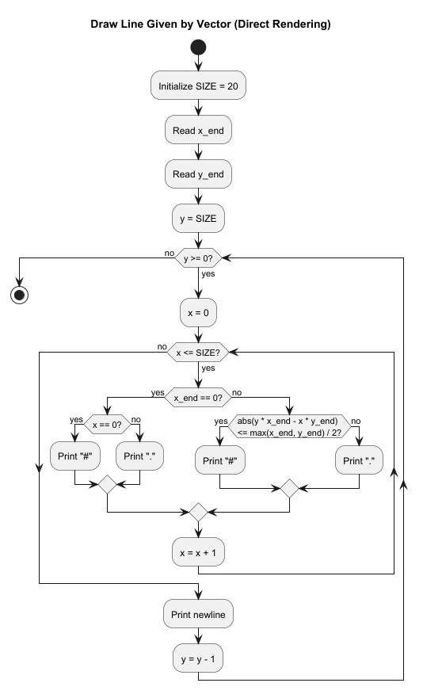

# Vykreslení přímky dané vektorem v ASCII mřížce


Cílem této úlohy je **vykreslit přímku v textové (ASCII) podobě** na pevně dané mřížce pomocí základních programovacích konstrukcí.

Program pracuje s **mřížkou o velikosti 20 × 20**, kde každý znak představuje jeden bod v rovině.  
Souřadnice mřížky jsou celočíselné a pohybují se v rozsahu od `0` do `20`.


## Vstup

Uživatel zadá dvě celočíselné hodnoty:

- `x` – x-ová složka vektoru (směr přímky)
- `y` – y-ová složka vektoru (směr přímky)

Tyto hodnoty určují **vektor vycházející z bodu (0, 0)**, který definuje směr přímky.


## Výstup

Program vypíše **ASCII obrázek mřížky 20 × 20**, kde:

- znak `#` označuje body, které leží **na přímce dané vektorem** (nebo jsou k ní nejblíže),
- znak `.` označuje ostatní body mřížky.

Přímka prochází bodem `(0, 0)` a má směr daný zadaným vektorem `(x, y)`.


## Omezení a pravidla

- Přímka je vykreslována **přímo při průchodu mřížkou**, bez předpočítávání bodů.
- Program používá pouze základní konstrukce:
  - vstup (`input`)
  - podmínky (`if`)
  - cykly (`while`)
  - výpis (`print`)
- Pokud je `x = 0`, jedná se o **svislou přímku**.


## Smysl úlohy

Úloha ukazuje, že:

- algoritmy nejsou jen o počítání čísel, ale také o **vizuální reprezentaci dat**,
- matematický objekt (přímka) lze vykreslit pomocí **aproximace v diskrétní mřížce**,
- i složitější chování může vzniknout kombinací **jednoduchých smyček a podmínek**.


## UML Activity diagram




## Ukázková implementace v Pythonu

```python
# grid size
SIZE = 20

x_end = int(input("Enter x: "))
y_end = int(input("Enter y: "))

y = SIZE
while y >= 0:
    x = 0
    while x <= SIZE:
        if x_end == 0:
            # vertical line
            if x == 0:
                print("#", end="")
            else:
                print(".", end="")
        else:
            # distance from the line ax - by = 0 (scaled)
            if abs(y * x_end - x * y_end) <= max(x_end, y_end) / 2:
                print("#", end="")
            else:
                print(".", end="")
        x = x + 1
    print()
    y = y - 1
```

Vstup: `x=100`, `y=20`, Výstup:
```
.....................
.....................
.....................
.....................
.....................
.....................
.....................
.....................
.....................
.....................
.....................
.....................
.....................
.....................
.....................
.....................
..................###
.............#####...
........#####........
...#####.............
###..................
```