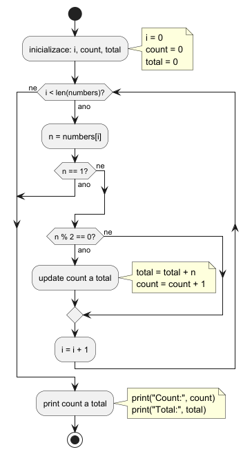

# Instrukce ke cvičení

Vaším úkolem je pro následující programy nakreslit **UML activity diagram (diagram aktivit)**.

- Každý program si pečlivě přečtěte a pochopte jeho logiku.
- Na papír zakreslete odpovídající diagram aktivit, který vystihuje:
  - tok programu,
  - podmínky (`if`),
  - cykly (`for`, `while`),
  - případná předčasná ukončení (`break`, `continue`).


## Organizace práce

- Máte čas omezený trváním cvičení.
- Úloh je více – **vaším cílem je vyřešit jich co nejvíce**.
- Začněte od první (nejjednodušší) a pokračujte dále podle obtížnosti.


## Důležité

- Diagram musí být **přehledný a správně strukturovaný**.
- Používejte standardní prvky UML activity diagramu:
  - start / end
  - akce (činnosti)
  - rozhodovací uzly (větvení)
  - cykly (zpětné hrany)
- Dbejte na správné zakreslení toku (šipek).

## Doporučení

- Nejprve si zkuste program „projít v hlavě“.
- Zaměřte se na:
  - kdy se podmínky vyhodnocují,
  - kam se program vrací při cyklu,
  - kdy může dojít k ukončení cyklu.

**Cíl:** Nejde jen o kreslení diagramů, ale o pochopení řízení toku programu.

## Zadání úloh

### Cvičná úloha na domací přípravu
```Python
numbers = [5, 2, 8, 1, 6, 3]

i = 0
count = 0
total = 0

while i < len(numbers):
    n = numbers[i]

    if n == 1:
        break

    if n % 2 == 0:
        total += n
        count += 1

    i += 1

print("Count:", count)
print("Total:", total)
```
Ukázkové řešení úlohy:




### Úlohy na cvičení

Budou ukázany na cvičení.