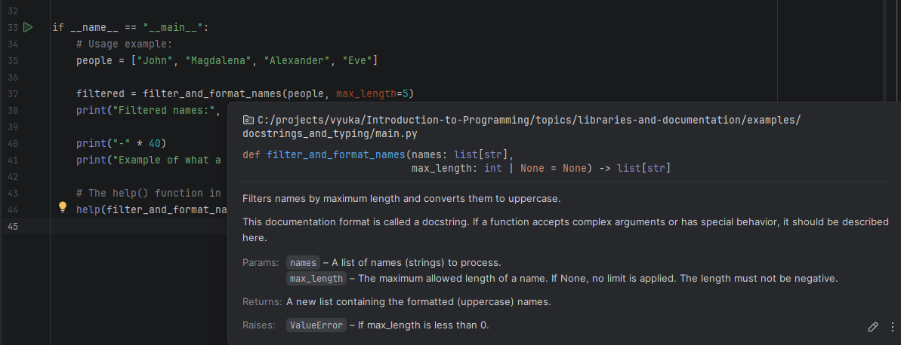

# Dokumentace kódu a typové nápovědy (Typing)

Tento příklad ukazuje, jak správně dokumentovat kód v Pythonu pro sebe, 
pro své kolegy a pro vývojové prostředí (IDE).

## Typové nápovědy (Type Hints)

Moderní Python silně využívá tzv. **Type Hints** (typové nápovědy). Nejde o statické typování (Python je stále dynamický), ale o nápovědu pro IDE (PyCharm, VS Code) a pro programátora.

Díky modulu `typing` (nebo zabudovaným typům jako `list`, `dict` v novějších verzích Pythonu) můžeme přesně popsat, co funkce přijímá a co vrací.

## Docstringy (Dokumentační řetězce)

Zatímco typové nápovědy řeší **co** (jaké typy dat), docstringy řeší **proč a jak**.
- Píší se hned pod definici funkce pomocí trojitých uvozovek `""" ... """`.
- Řídí se konvencí [PEP 257](https://peps.python.org/pep-0257/.
- IDE je umí hezky zobrazit.
- Z docstringů lze automaticky generovat celou HTML dokumentaci k projektu (nástroje jako Sphinx, pdoc).

## Ukázka kódu

Podívejte se do souboru `main.py` a zkuste si ho spustit. Uvidíte, že Python sám umí přečíst vaši dokumentaci přes vestavěnou funkci `help()`.

Pokud v rámci IDE najedete kurzorem na název funkce, uvidíte její docstring a typové nápovědy.

